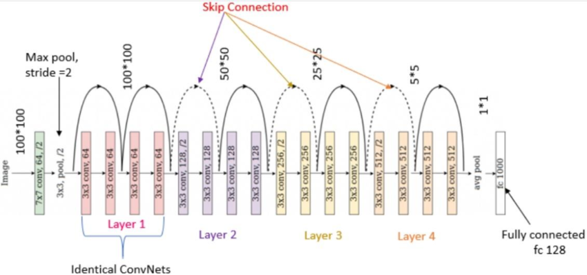

# 🎗️Breast Histopathology IDC Detection

A web application for detecting Invasive Ductal Carcinoma (IDC) in breast histopathology images using deep learning.

## 🎫 Features

- Real-time image analysis
- Visual confidence score display
- Support for PNG, JPG, and JPEG images
- GPU acceleration (if available)

## 🧠 Model Architecture

This project uses **ResNet-18**, a residual convolutional neural network developed by Microsoft. Skip connections allow for deeper and more accurate networks.

🎉**Customizations:**
- Final fully connected layer changed for binary classification
- Pretrained weights used (on ImageNet)
- Fine-tuning applied



## 👾 Installation

1. Install dependencies:
```bash
pip install -r requirements.txt
```

## 📢Usage

1. Start the application:
```bash
python app.py
```

2. Open your browser and go to:
```
http://localhost:5000
```

3. Upload a histopathology image to get the prediction.

## 🪶 Model Information

- Architecture: ResNet18
- Input size: 224x224 pixels
- Output: Binary classification (IDC Positive/Negative)

## 📁 Dataset 
- **Source**: [Breast Histopathology Images](https://www.kaggle.com/datasets/paultimothymooney/breast-histopathology-images)

## 🕸️ File Structure

```
.
├── app.py              # Flask app
├── train.py            # Trains model
├── extract.py          # Extract zip file
├── training_results    
│   └── best_model.pth
│   └── training_metrics.csv
│   └── training_metrics.png       
├── requirements.txt    # Python dependencies  
├── README.md
├── Original-ResNet-18-Architecture.png
├── templates/         # HTML templates
│   └── index.html     # Web interface
└── uploads        # Uploaded images
```


